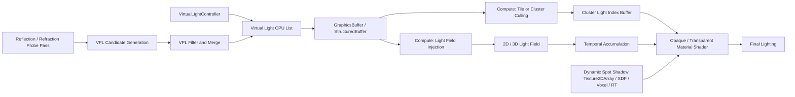

# 仮想ライトベース光シミュレーション 技術選定・仕様書

> この文書は将来拡張を含む設計ロードマップです。現在の実装範囲と制約は `README.md` および `Documentation~/index.md` を正とします。

- **文書種別**: 技術選定 / 基本設計
- **ステータス**: Draft
- **対象**: リアルタイム3Dレンダリング
- **推奨実装**: Unity + HLSL + Compute Shader
- **移植対象**: Unreal Engine / Godot / 独自レンダラー

---

## 1. 概要

本機能は、エンジン標準ライトとは独立した「仮想ライト」をシーン内に配置または動的生成し、物体表面・透明体・霧などへ光の影響を与えるためのリアルタイム照明システムである。

単純な追加ライトとしての利用に加え、反射・屈折・集光の結果地点へ仮想ライトを生成することで、以下の表現を可能にする。

- 鏡や金属面で反射した光が別の物体を照らす
- 水やガラスを通過した光が床や壁へ集光する
- 色付き物体からの反射光による色移り
- 発光体から周囲への疑似的な間接照明
- 霧や水中での光量・散乱への影響
- 時間方向に滑らかに変化する光跡や残光

本仕様では、リアルタイム性と拡張性のバランスから、**動的StructuredBufferによる仮想ライト管理、Compute Shaderによるライト選別・光場更新、マテリアルシェーダーによる最終評価**を組み合わせたハイブリッド構成を採用する。

> 元映像が干渉・回折・偏光などの波動光学を主現象としている場合、本仕様だけでは物理的な再現にならない。その場合は複素振幅または波動伝播を扱う別モジュールを追加する。

---

## 2. 前提条件

### 2.1 想定環境

| 項目 | 想定 |
|---|---|
| レンダリング方式 | リアルタイム・ラスタライズ主体 |
| 推奨エンジン | Unity |
| シェーダー | HLSL |
| GPU処理 | Compute Shader対応環境 |
| 主対象 | PC / 据え置き機 |
| 基準解像度 | 1920 × 1080 |
| 目標フレームレート | 60 fps |
| 参照ハードウェア | プロジェクト開始時に確定する |

### 2.2 Unityでの推奨構成

- URP: カスタムRenderer FeatureまたはRender Graphで実装
- HDRP: Custom Passまたは既存のボリューム機能と統合
- ライトデータ: `GraphicsBuffer` / `StructuredBuffer`
- 中間結果: `RenderTexture`
- 光場・体積光: 2Dまたは3Dの書き込み可能テクスチャ
- GPU計測: Profiler / GPU Frame Debugger相当の計測機能

### 2.3 対象外

初期実装では以下を対象外とする。

- 完全なパストレーシング
- 無制限の多重反射
- 厳密な波動光学
- 偏光
- スペクトル単位の色分散
- Point型とRectangle Area型のシャドウ、および透明物体を透過する厳密なシャドウ
- モバイル端末を基準とした最適化

---

## 3. 要求仕様

### 3.1 機能要件

1. ランタイム中に仮想ライトを追加・更新・削除できること。
2. 仮想ライトは位置、色、強度、半径、方向、種類を持つこと。
3. Point型、Spot型、Rectangle Area型を必須対応とすること。
4. Rectangle Area型は幅・高さ・片面発光方向・近似サンプル数を指定できること。
5. 仮想ライトが不透明物体のPBRライティングへ影響すること。
6. 必要に応じて、透明物体・霧・水中表現へも影響できること。
7. 複数ライトの影響を同時に加算できること。
8. パッケージ固有のライト数上限を設けず、登録数に応じてGPUバッファを動的に拡張できること。
9. 光が遮蔽物を無視して壁裏へ到達する現象を抑制できること。
10. 動的な反射・屈折結果から仮想ライト候補を生成できる拡張性を持つこと。
11. デバッグ表示でライト範囲、光量、遮蔽、クラスタ占有率を確認できること。
12. Sceneビュー上でライト種別、方向、範囲、面サイズ、選択状態を判別できるEditor Gizmoを提供すること。

### 3.2 非機能要件

- ライト更新は原則として描画フレーム内に反映する。
- 1080p、64仮想ライト時の追加GPUコストは、基準ハードウェア上で合計3 ms以内を目標とする。
- 数値発散、NaN、無限大をシェーダー内で発生させない。
- GPUバッファやシャドウ配列の拡張に失敗した場合も、範囲外アクセスや描画破綻を発生させない。
- 品質設定によって影と光場の解像度を変更できるが、ライト数は制限しない。
- Compute Shader非対応環境では、動的StructuredBuffer上の全ライトを直接評価する方式へフォールバックできる。

> 性能値は設計目標であり、参照ハードウェア確定後に実測して調整する。

---

## 4. 技術選定

### 4.1 採用構成

以下のハイブリッド方式を採用する。

1. **仮想ライト管理**  
   CPU側でライトを管理し、GPUの`StructuredBuffer`へ転送する。

2. **ライトカリング**  
   Compute Shaderで画面タイルまたは3Dクラスタごとに影響ライトを選別する。

3. **表面ライティング**  
   マテリアルシェーダーは、該当クラスタのライトだけをPBR評価へ加算する。

4. **光場・体積光**  
   必要な場合、Compute Shaderで2D/3Dテクスチャへ光量を注入し、霧・水中・残光へ利用する。

5. **遮蔽**  
   CastShadowが有効なSpotライトには、動的`Texture2DArray`のスライスを割り当てる。
   不透明PBRとビームボリュームは同じスライスを参照する。
   Point型、Rectangle Area型、透明伝搬には、SDF、ボクセル、スクリーンスペース近似、またはレイトレーシングを拡張方式として使用する。

6. **時間安定化**  
   光場や低サンプルの間接光にはTemporal Accumulationを適用する。

### 選定理由

- 標準ライトだけを増やす方式より、ライト生成規則と光の伝播を自由に制御できる。
- 各ピクセルで全ライトをループする方式より、多数ライトへ拡張しやすい。
- 光場テクスチャだけに依存する方式より、表面の法線・粗さ・金属度を正しく反映しやすい。
- ハードウェアレイトレーシング必須方式より、対応環境を広く保てる。
- 高品質環境ではレイトレーシングへ段階的に拡張できる。

---

### 4.2 比較した方式

| 方式 | 長所 | 短所 | 判定 |
|---|---|---|---|
| エンジン標準ライトを追加 | 実装が最小、既存影機能を利用可能 | ライト数増加時に重い、動的生成や独自伝播の制約が大きい | 小規模プロトタイプのみ |
| フラグメントシェーダーで全ライト評価 | 実装が単純、Compute Shader非対応環境でも動作可能 | ピクセル数 × ライト数で負荷増加 | 動的StructuredBufferを使うフォールバック |
| Tiled / Clustered Lighting | 多数ライトに強い、PBRと統合しやすい | カリングとバッファ管理が必要 | **採用** |
| 2D光場テクスチャ | 受光面への投影、ぼかし、残光に向く | 任意形状や奥行きの表現に弱い | 補助機能として採用 |
| 3D Froxel / Volume Texture | 霧、水中、体積散乱に向く | メモリと帯域を消費 | オプション採用 |
| Virtual Point Lightのみ | 間接光を直感的に近似可能 | 光漏れ、エネルギー過多、ちらつきが発生しやすい | Phase 2で採用 |
| ハードウェアレイトレーシング | 遮蔽と反射の精度が高い | 対応環境とGPU負荷の制約 | 高品質オプション |
| オフライン焼き込み | 実行時負荷が低い | 動的ライト・動的形状に弱い | 静的演出用の代替案 |

---

## 5. システム構成



---

## 6. 仮想ライトのデータ仕様

GPU上の構造体は、CPUとHLSL間のレイアウト差異を避けるため、`float4`単位で構成する。

### 6.1 HLSL

```hlsl
struct VirtualLightGpu
{
    // xyz: world position, w: radius
    float4 positionRadius;

    // rgb: linear color, w: intensity
    float4 colorIntensity;

    // xyz: normalized direction, w: light type
    float4 directionType;

    // x: inner cone cos
    // y: outer cone cos
    // z: shadow index (-1 = none)
    // w: packed flags
    float4 coneShadowFlags;

    // x: area width
    // y: area height
    // z: area sample count or approximation mode
    // w: reserved
    float4 areaSizeParams;
};

StructuredBuffer<VirtualLightGpu> _VirtualLights;
uint _VirtualLightCount;
```

1ライトあたり80 byteとする。
たとえば256ライトを登録した場合、ライト本体データは20 KiBである。
この値は容量上限ではなく、メモリ見積もりの例である。

### 6.2 C#

```csharp
using System.Runtime.InteropServices;
using UnityEngine;

[StructLayout(LayoutKind.Sequential)]
public struct VirtualLightGpu
{
    public Vector4 PositionRadius;
    public Vector4 ColorIntensity;
    public Vector4 DirectionType;
    public Vector4 ConeShadowFlags;
    public Vector4 AreaSizeParams;
}
```

### 6.3 ライト種別

| 値 | 種別 | 対応フェーズ |
|---:|---|---|
| 0 | Point | MVP |
| 1 | Spot | MVP |
| 2 | Rectangle Area | MVP |
| 3 | Directional Proxy | 任意 |
| 4 | Disc Area | Phase 2 |
| 5 | Tube / Line Area | Phase 2 |
| 6 | Generated VPL | Phase 2 |

### 6.4 フラグ候補

- Enabled
- CastShadow
- AffectOpaque
- AffectTransparent
- AffectVolume
- Generated
- Static
- DebugSelected

---

## 7. CPU側API仕様

```csharp
public interface IVirtualLightSystem
{
    VirtualLightHandle Register(in VirtualLightDescriptor descriptor);
    void Update(VirtualLightHandle handle, in VirtualLightDescriptor descriptor);
    void Unregister(VirtualLightHandle handle);
    void ClearGeneratedLights();
    void SetQuality(VirtualLightQuality quality);
}
```

### 7.1 Descriptor

```csharp
public struct VirtualLightDescriptor
{
    public Vector3 Position;
    public Vector3 Direction;
    public Color LinearColor;
    public float Intensity;
    public float Radius;
    public float InnerConeAngle;
    public float OuterConeAngle;
    public Vector2 AreaSize;
    public int AreaSampleCount;
    public bool TwoSided;
    public VirtualLightType Type;
    public VirtualLightFlags Flags;
    public int Priority;
}
```

### 7.2 更新規則

- 静的ライトは変更があった場合のみGPUへ再転送する。
- 動的ライトは毎フレーム更新可能とする。
- 生成ライトは専用領域へ格納し、ユーザー配置ライトより低い優先度を既定値とする。
- CPU配列とGPUバッファは登録ライト数に応じて動的に拡張する。
- パッケージ固有の固定数でライトを間引かない。
  Priorityは安定した処理順と将来の負荷制御方針に利用できるが、登録ライトを暗黙に無効化する条件にはしない。
- ライト用GPUバッファの再確保が失敗した場合は、CPU側の登録を維持し、そのカメラのGPU評価件数を0にしてエラーを報告する。

### 7.3 Editorコンポーネント

シーン配置用には `VirtualLight` MonoBehaviourを提供する。ランタイム用Descriptorの生成元とし、標準Lightコンポーネントとは独立して動作する。

```csharp
[ExecuteAlways]
public sealed class VirtualLight : MonoBehaviour
{
    [SerializeField] private VirtualLightType type = VirtualLightType.Point;
    [ColorUsage(true, true)]
    [SerializeField] private Color color = Color.white;
    [Min(0f)] [SerializeField] private float intensity = 1f;
    [Min(0.01f)] [SerializeField] private float range = 5f;

    [Header("Spot")]
    [Range(0f, 179f)] [SerializeField] private float innerAngle = 25f;
    [Range(0f, 179f)] [SerializeField] private float outerAngle = 40f;

    [Header("Area")]
    [SerializeField] private Vector2 areaSize = Vector2.one;
    [Range(1, 16)] [SerializeField] private int areaSampleCount = 4;
    [SerializeField] private bool twoSided;

    [Header("Debug")]
    [SerializeField] private bool alwaysShowGizmo = true;
    [SerializeField] private bool showInfluenceVolume = true;
    [SerializeField] private bool showSamplePoints;
}
```

- `transform.position`: ライト中心。
- `transform.forward`: SpotおよびAreaの照射方向。
- `transform.right / up`: Rectangle Areaの面方向。
- Transform Scaleはライト寸法へ暗黙反映せず、`Range`と`AreaSize`を明示値として扱う。
- 負のScaleは未対応とし、Inspectorに警告を表示する。
- `InnerAngle > OuterAngle`の場合はInspectorで自動補正する。
- `AreaSize`の各軸は0.01以上にクランプする。

---

## 8. Editor Gizmo / Scene操作仕様

### 8.1 基本方針

VirtualLightは、非選択時でも種類と大まかな範囲が分かり、選択時には正確な形状と編集ハンドルが表示されること。標準Unity Lightの見た目に近づけつつ、仮想ライトであることを破線・アイコン・接頭表示で区別する。

### 8.2 共通表示

- ライト位置に専用アイコンを表示する。
- アイコンはライト色で着色し、HDR色は表示用に正規化する。
- 非選択時は低いAlpha、選択時は高いAlphaで表示する。
- 無効状態はグレー表示にする。
- 影ありはアイコン横に小さな影マークを表示する。
- 生成VPLは手動ライトと異なる点線表示にする。
- Sceneビューの距離に応じてアイコンサイズを一定に保つ。
- `alwaysShowGizmo == false` の場合、選択中のみ表示する。

### 8.3 Point Gizmo

- 中心から6方向へ短い放射線を表示する。
- 影響範囲をワイヤースフィアで表示する。
- 選択時はRange用の半径ハンドルを表示する。
- 影響度の目安として、25%、50%、100%範囲を任意表示できる。

### 8.4 Spot Gizmo

- `transform.forward`方向へ外側コーンを表示する。
- 外側コーンは `OuterConeAngle` と `Range` で決定する。
- 内側コーンは細い線または半透明表示で区別する。
- 先端面に円周を描き、照射範囲を明確にする。
- 選択時に以下のハンドルを表示する。
  - Rangeハンドル
  - Inner Angleハンドル
  - Outer Angleハンドル
  - 方向回転ハンドル
- InnerとOuterは異なる線種で表示し、角度の逆転が起きないよう制約する。

### 8.5 Rectangle Area Gizmo

- ライト面を `transform.right` × `AreaSize.x`、`transform.up` × `AreaSize.y` の矩形として表示する。
- 発光面の四隅と外周を描画する。
- 片面発光時は `transform.forward`方向へ矢印を表示する。
- 両面発光時は正負両方向へ矢印を表示する。
- 影響範囲は矩形を起点とする角錐台または押し出しボリュームとして近似表示する。
- 選択時に以下のハンドルを表示する。
  - Widthハンドル
  - Heightハンドル
  - Rangeハンドル
  - 発光方向回転ハンドル
- `showSamplePoints` 有効時は、内部近似に使用するPoint/Spotサンプル位置を面上に表示する。
- サンプル点はランタイムの近似配置と一致させる。

### 8.6 Area Lightのランタイム近似

Rectangle Areaは、MVPではLTC等の厳密な面光源評価を必須とせず、用途と品質に応じて以下を切り替える。

| モード | 内容 | 用途 |
|---|---|---|
| Single Representative | 面中心の代表ライト1灯 | 遠距離・Low |
| Multi Sample | 面上に2〜16個の仮想Point/Spotを配置 | 標準品質 |
| Analytic Rectangle | 矩形面光源の解析近似 | High以降 |
| Light Field Injection | 面から2D/3D光場へ直接注入 | 霧・演出 |

既定は4サンプルとし、サンプル数は1、2、4、8、16から選択する。サンプルごとの強度は総エネルギーが増えないよう `Intensity / SampleCount` を基準に配分する。

### 8.7 Sceneビューのデバッグ切替

InspectorまたはSceneビューOverlayから次を切り替えられるようにする。

- Gizmo常時表示
- 影響範囲
- Areaサンプル点
- Spot Shadow Texture2DArrayのスライス番号
- クラスタ登録範囲
- 推定寄与値
- カリング状態
- 遮蔽モード

### 8.8 Custom Editor要件

- ライト種別ごとに不要な項目を非表示にする。
- SpotではInner/Outer Angleを角度スライダーで編集できること。
- Rectangle Areaでは2D Sizeハンドルと数値入力を同期すること。
- 複数選択編集に対応する。
- Undo/Redo、Prefab Override、Copy/Pasteに対応する。
- 不正値、未対応Scale、GPUリソース確保失敗、シャドウなしへの縮退をHelpBoxで通知する。
- `OnSceneGUI`の操作中は `Undo.RecordObject` を使用し、変更後に `EditorUtility.SetDirty` を適切に呼ぶ。

### 8.9 Gizmo実装方針

- 非選択表示: `OnDrawGizmos` / `OnDrawGizmosSelected`。
- 編集ハンドル: `CustomEditor.OnSceneGUI`。
- 角度編集: `Handles.ConeHandleCap` 相当または独自円弧ハンドル。
- 矩形編集: `Handles.Slider` または `BoxBoundsHandle`を平面制約して使用。
- アイコン: `Gizmos.DrawIcon`またはSceneView Overlay。
- Gizmo描画はEditor専用Assemblyへ分離し、Playerビルドへ含めない。

---

## 9. レンダリングパイプライン仕様

### 9.1 フレーム処理順

1. CPU側のライト差分を収集する。
2. ライトデータをGPUバッファへ転送する。
3. Compute Shaderでライトの画面範囲またはクラスタ範囲を算出する。
4. クラスタごとのライトインデックス一覧を生成する。
5. 必要に応じて光場テクスチャへライトを注入する。
6. 遮蔽情報を更新する。
7. 不透明物体を描画し、仮想ライトをPBR評価へ加算する。
8. 透明物体を描画する。
9. 体積光をレイマーチする。
10. Temporal Accumulationとアップサンプリングを行う。
11. デバッグ表示を合成する。

### 9.2 実行タイミング

- 深度プリパス後にライトカリングを行う。
- 不透明物体描画前にクラスタ情報を確定する。
- 透明物体は不透明物体と同じライトリストを参照できる。
- 体積光は不透明深度を参照して積分距離を制限する。
- Spotビームは出射レンズ径を持つ有限フラスタムとして扱い、カメラレイと実ビーム領域の解析交差区間だけを積分する。
- 規則的なレイマーチ断面が円盤または三角スライスとして露出しないよう、安定した層化ジッタと補間済み密度ノイズを使用する。
- 解析交差はBounds入口を局所原点とする安定な二次方程式で解き、PerspectiveとOrthographicの双方で逆View Projectionから画素レイを再構築する。
- 有限出射径を持つビームのシャドウは、物理レンズ後方の等価仮想頂点から投影し、ボリューム外周をシャドウFOV外として可視化しない。
- ビーム断面は、Gaussian型の高輝度コアと滑らかな低輝度外周へ分離する。コア半径の変更で有限フラスタムやシャドウ境界を拡張しない。
- 位相関数は正規化Henyey-Greensteinと等方散乱`1 / (4π)`の凸結合とし、強い前方散乱を保ちながら側面視認性を独立調整する。
- HDRコアから生じるBloomはVisibility評価後のカメラ効果とし、遮蔽前のボリューム半径を見た目目的で拡張しない。

---

## 10. ライトカリング仕様

### 10.1 推奨方式

- MVP: 画面空間Tiled Lighting
- 標準品質以上: 深度方向を含むClustered Lighting

### 10.2 タイル / クラスタ

| 項目 | 既定値 |
|---|---:|
| タイルサイズ | 16 × 16 pixel |
| 深度スライス | 24 |
| 1タイルまたは1クラスタのライトインデックス容量 | 現在の有効ライト数に合わせて動的確保 |
| 確保失敗時 | 動的StructuredBufferの直接評価へ切替 |

深度スライスは線形ではなく、カメラ近傍を細かくする対数寄りの分割を推奨する。

### 10.3 バッファ

- Cluster Offset Buffer
- Cluster Count Buffer
- Light Index Buffer
- Overflow Counter

### 10.4 容量管理

- ライトインデックスの必要要素数は、タイル数またはクラスタ数と有効ライト数から算出する。
- バッファは必要容量以上へ動的に拡張し、固定されたクラスタ枠を理由にライトを除外しない。
- 要素数の乗算は整数オーバーフローを検査し、確保不能時は動的StructuredBufferの直接評価へ切り替える。
- デバッグビルドでは、確保済み容量、必要容量、直接評価への切替状態を表示する。

---

## 11. 表面ライティング仕様

仮想ライトは、既存のPBR BRDFへ追加の入射光として渡す。

```text
Lo += BRDF(material, N, V, L)
      × LightColor
      × Intensity
      × DistanceAttenuation
      × SpotAttenuation
      × Visibility
      × NdotL
```

### 11.1 距離減衰

```hlsl
float EvaluateRangeAttenuation(float distanceToLight, float radius)
{
    float normalized = saturate(1.0 - distanceToLight / max(radius, 1e-4));
    float rangeFade = normalized * normalized;
    float inverseSquare = rcp(max(distanceToLight * distanceToLight, 1e-2));
    return rangeFade * inverseSquare;
}
```

### 11.2 Spot減衰

```hlsl
float EvaluateSpotAttenuation(
    float3 lightDirection,
    float3 directionFromLight,
    float innerCos,
    float outerCos)
{
    float cosTheta = dot(lightDirection, directionFromLight);
    return smoothstep(outerCos, innerCos, cosTheta);
}
```

### 11.3 強度単位

MVPでは強度をエンジン内の相対値として扱う。物理単位へ寄せる場合は、標準ライトとの見た目を比較し、強度変換係数を別途定義する。

### 11.4 エネルギー制御

- 1ライトの最大強度を設定可能にする。
- 全仮想ライト寄与にソフトクランプを適用できる。
- 生成VPLは元の光エネルギーを超えないように減衰させる。
- 露出前のHDR値を保持し、最終的な見た目はトーンマッピングへ委ねる。

---

## 12. 光場テクスチャ仕様

光場テクスチャは、以下の用途で使用する。

- 多数ライトの寄与を事前集約する
- 霧・水中への光注入
- 残光・光跡
- 低周波の間接光
- カースティクス風投影

### 12.1 2D光場

受光面やスクリーンスペースへ光量を投影する用途に使用する。

推奨フォーマット:

- `RGBA16F`
- RGB: 光量
- A: 信頼度、厚み、または履歴重み

### 12.2 3D光場 / Froxel

霧・水中・ボリューム用途に使用する。

推奨初期解像度:

```text
160 × 90 × 64
```

1080pに対し低解像度で計算し、深度と法線を用いてアップサンプリングする。

### 12.3 ダブルバッファ

```text
LightFieldPrevious
    ↓
Temporal Accumulation
    ↓
LightFieldCurrent
```

毎フレーム、PreviousとCurrentを入れ替える。

---

## 13. 遮蔽・影仕様

仮想ライトで明るさだけを加算すると、遮蔽物の裏側へ光が漏れるため、用途に応じて遮蔽方式を選択する。

### 13.1 遮蔽モード

| モード | 精度 | 負荷 | 用途 |
|---|---|---|---|
| None | 低 | 最小 | 演出ライト、発光補助 |
| Screen Space | 低〜中 | 低 | カメラ内の近似影 |
| SDF / Voxel | 中 | 中 | 多数ライトの広域遮蔽 |
| Dynamic Spot Shadow Texture2DArray | 高 | 中〜高 | CastShadowが有効なSpotライト |
| Ray Traced Shadow | 高 | 高 | 対応環境の高品質設定 |

### 13.2 推奨デフォルト

- CastShadowが有効なSpotライトごとに、カメラ単位のシャドウスライスを割り当てる。
- `VirtualLightOccluder`配下の不透明Rendererを、登録済みのシャドウキャスターとして描画する。
- 不透明PBRシェーダーとビームボリュームは、各Spotライトに割り当てた同一スライスのVisibilityを参照する。
- ビームボリューム自体はシャドウキャスターに含めず、複数ビームの放射輝度は加算する。
- 生成VPL、Point型、Rectangle Area型には、必要に応じてSDFまたはVoxel近似を拡張する。
- 高品質設定では、選択した遮蔽方式をレイトレーシングへ置換可能とする。

### 13.3 動的Spot Shadow Texture2DArray

| 項目 | 仕様 |
|---|---|
| シャドウリソース | カメラ単位の`Texture2DArray` |
| スライス数 | CastShadowが有効なSpotライト数に合わせて動的確保 |
| スライス解像度 | Low: 256、Medium: 512、High: 768、Ultra: 1024 |
| メタデータ | ライト行列と位置・逆Rangeを動的`GraphicsBuffer`へ格納 |
| キャスター | `VirtualLightOccluder`配下の不透明Renderer |
| フィルタ | 3 × 3 Tent PCF相当 |
| 確保失敗時 | ライトを維持し、該当カメラではシャドウなしで評価 |

1ライトに1スライスを対応させるため、タイル状の固定区画へ割り当てる方式は採用しない。
パッケージ固有のシャドウ灯数上限も設けない。
実用上の制約は、GPUの`Texture2DArray`スライス数、テクスチャ寸法、メモリ容量、確保可否、および許容フレーム時間である。

PhysicsのRaycastまたはSphereCastで得る中心軸の交差距離は、衝突表示と意図的なビーム打ち切りにのみ利用する。
曲面や斜面を含む表面PBR、およびビーム内部の各レイマーチサンプルのVisibilityは、ライト別のシャドウスライスから評価する。

### 13.4 光漏れ対策

- 法線方向オフセット
- 深度バイアス
- 受光面の厚み推定
- SDFの安全距離
- VPLを面の法線より内側へ生成しない
- 遮蔽信頼度が低い場合は寄与を弱める

---

## 14. VPL生成仕様

VPLは、反射・屈折・受光結果から生成する二次的な仮想ライトである。

### 14.1 対応フェーズ

- MVPでは手動配置ライトのみを必須とする。
- VPL自動生成はPhase 2で実装する。

### 14.2 生成フロー

1. 主光源からサンプルレイを生成する。
2. 反射面または屈折面との交差を求める。
3. 次の受光地点を求める。
4. 到達光量が閾値以上ならVPL候補を作る。
5. 近接する候補を空間的に統合する。
6. エネルギー閾値と空間統合を通過した候補を動的VPLバッファへ格納する。
7. 次フレームへ時間的に安定化して渡す。

### 14.3 MVP後の既定制約

| 項目 | 値 |
|---|---:|
| 反射バウンス深度の初期値 | 1 |
| VPLバッファ容量 | 候補数に応じて動的確保 |
| 最小エネルギー閾値 | 調整可能 |
| 近接統合半径 | ライト半径に対する割合で指定 |
| 履歴寿命 | 2〜8 frameの範囲で調整 |

VPL数にもパッケージ固有の固定上限を設けない。
エネルギー閾値と空間統合は物理的な寄与と重複を整理するための処理であり、固定枠へ収めるための切り捨てには使用しない。
実際に扱える候補数はGPUメモリと処理時間によって決まる。

### 14.4 VPLの強度

```text
VPL Energy = Incoming Energy
             × Surface Reflectance or Transmittance
             × Geometric Attenuation
             × User Scale
```

以下を必須とする。

- 元の光エネルギーを超える増幅を既定では禁止する。
- 反復的にVPLがVPLを生成するフィードバックを禁止する。
- 極端に狭い高強度ライトは統合またはクランプする。

---

## 15. 時間安定化仕様

### 15.1 対象

- VPL候補
- 低サンプルの光場
- ボリューム光
- レイトレース遮蔽

### 15.2 処理

```text
Current = CurrentFrameSample
History = Reproject(PreviousFrame)
Result  = Lerp(Current, History, HistoryWeight)
```

### 15.3 履歴棄却条件

- 深度差が閾値を超える
- 法線差が閾値を超える
- ライトIDまたはライト位置が大きく変化した
- カメラカット
- オブジェクトのテレポート
- 光場解像度または品質設定の変更

### 15.4 ゴースト対策

- Neighborhood Clamping
- 応答速度の下限設定
- 明るさが急増した場合は履歴重みを下げる
- 動的物体のモーションベクトルを利用する

---

## 16. 品質プリセット

| 設定 | Spotシャドウスライス解像度 | ライト評価 | 光場 | VPL |
|---|---:|---|---|---|
| Low | 256 | Tiledまたは動的直接評価 | なし | なし |
| Medium | 512 | Tiledまたは動的直接評価 | 2Dのみ | 動的バッファ |
| High | 768 | TiledまたはClustered | 2D / 3D | 動的バッファ |
| Ultra | 1024 | TiledまたはClustered、RTへ拡張可能 | 高解像度3D | 動的バッファ |

品質プリセットはライト数とシャドウスライス数を制限しない。
プリセットが制御するのは、1スライスあたりの解像度、光場の有無と解像度、および拡張遮蔽方式である。
各リソースは登録数に応じて動的確保し、GPU能力と許容フレーム時間を運用上の予算とする。

---

## 17. パフォーマンス目標

### 17.1 1080p / High設定の目標

| パス | GPU目標 |
|---|---:|
| ライトカリング | 0.5 ms以下 |
| 表面仮想ライト評価 | 1.0 ms以下 |
| 光場注入 | 0.6 ms以下 |
| Temporal / Upsample | 0.5 ms以下 |
| 遮蔽追加コスト | 0.8 ms以下 |
| 合計 | 3.0 ms前後 |

上記は初期目標であり、最終値は参照シーンとハードウェアによって決定する。

### 17.2 CPU目標

- 通常フレームのライト更新: 0.3 ms以下
- GC Allocation: 0 byte / frame
- GPU転送: Dirty Rangeのみ更新
- ライト登録・解除はハンドル方式で管理する

### 17.3 メモリ目標

| 項目 | 目安 |
|---|---:|
| ライト本体（256灯の計測例） | 20 KiB |
| ライトインデックス | 数百KiB〜数MiB |
| 3D光場 RGBA16F | 約7.4 MiB / buffer |
| 3D光場ダブルバッファ | 約14.8 MiB |
| Spot Shadow Texture2DArray | `解像度 × 解像度 × スライス数 × 1 texelあたりbyte数` |

---

## 18. フォールバック仕様

Compute Shaderが使用できない場合、以下へ切り替える。

1. 登録ライトを動的StructuredBufferへ転送する。
2. マテリアルシェーダーで`_VirtualLightCount`件を直接評価する。
3. タイルインデックス生成、光場、VPL自動生成、体積注入を無効化する。
4. Texture Arrayと必要な描画機能を使用できる場合は、カスタムSpotシャドウを継続する。
5. シャドウリソースを確保できない場合は、ライト本体を維持したままVisibilityを1として評価する。

直接評価はライト数に比例して負荷が増えるが、パッケージ側で固定件数へ切り詰めない。
運用上の性能予算を超える場合は、シーン設計または明示的なユーザー設定でライトを無効化する。

---

## 19. デバッグ・可視化仕様

以下の表示モードを用意する。

- 仮想ライト位置
- ライト半径
- Spotコーン
- ライトID / 優先度
- 生成VPLと手動ライトの色分け
- クラスタごとのライト数
- クラスタオーバーフロー
- 光場RGBヒートマップ
- 遮蔽率
- Temporal履歴重み
- ライト寄与のみの表示
- 直接光 / 仮想光 / 光場の分離表示

GPUカウンタとして以下を取得する。

- 登録ライト数
- 有効ライト数
- 生成VPL候補数
- 採用VPL数
- オーバーフロークラスタ数
- 平均ライト数 / クラスタ
- ピークライト数 / クラスタ

---

## 20. エラー処理

- 半径が0以下の場合はライトを無効化する。
- 強度が負の場合は0へクランプする。
- 方向ベクトルが0の場合は既定方向を設定する。
- cone角度の内外が逆の場合は入れ替える。
- ライト用GPUバッファの再確保に失敗した場合は、CPU側の登録を維持し、そのカメラのGPU評価件数を0にして範囲外アクセスを防いだ上でエラーを報告する。
- タイルまたはクラスタ用バッファの確保に失敗した場合は、動的StructuredBufferの直接評価へ切り替える。
- シャドウ用Texture2DArrayまたはメタデータバッファの確保に失敗した場合は、ライトを無効化せずシャドウなしへ縮退する。
- NaNまたはInfinityを検出した値は0へ置換する。
- 品質変更時はTemporal履歴を破棄する。

---

## 21. 受け入れ条件

### 21.1 MVP

- [ ] Point型仮想ライトをランタイムで追加・移動・削除できる。
- [ ] Spot型仮想ライトを利用できる。
- [ ] 色、強度、半径の変更が1フレーム以内に反映される。
- [ ] 64灯を登録しても描画が破綻しない。
- [ ] タイルまたはクラスタ単位のライト選別が動作する。
- [ ] 不透明PBRマテリアルへ光が反映される。
- [ ] 登録ライト数の増減に応じてGPUバッファが拡張され、固定件数を理由に寄与が欠落しない。
- [ ] CastShadowが有効なSpotライト数に応じてシャドウスライスが拡張される。
- [ ] 不透明PBRとビームボリュームが、同じSpotライトのシャドウVisibilityを参照する。
- [ ] デバッグ表示で各ライトの影響範囲を確認できる。
- [ ] NaN、バッファ範囲外アクセス、GPUハングが発生しない。

### 21.2 標準版

- [ ] 遮蔽物の裏側への光漏れが、選択した遮蔽方式で抑制される。
- [ ] 透明物体または体積光へ影響できる。
- [ ] 光場テクスチャへライトを注入できる。
- [ ] Temporal Accumulationによってちらつきを抑えられる。
- [ ] 1080pの参照シーンで追加GPUコストが目標範囲内に収まる。

### 21.3 拡張版

- [ ] 反射または屈折結果からVPLを生成できる。
- [ ] VPLの空間統合と動的バッファ管理が動作する。
- [ ] VPLが元光源以上のエネルギーを生成しない。
- [ ] 動的シーンで目立つポッピングを抑制できる。
- [ ] 高品質設定でレイトレーシング遮蔽へ切り替えられる。

---

## 22. テスト仕様

### 22.1 機能テスト

1. 白色Pointライトを白い平面上で移動する。
2. 赤・緑・青ライトを重ね、線形色空間で加算されることを確認する。
3. Spotライトの内角・外角を変更し、境界が滑らかに変化することを確認する。
4. 半径外で寄与が0になることを確認する。
5. 遮蔽物の前後でVisibilityが変化することを確認する。
6. ライト登録数を段階的に増減し、GPUバッファが動的に拡張および再利用されることを確認する。
7. カメラカット時にTemporal履歴が残らないことを確認する。

### 22.2 性能テスト

- 16 / 64 / 128 / 256ライト
- 静的ライトのみ
- 全ライト移動
- 全ライト点滅
- 単一クラスタへの集中
- 均等分散
- 影なし / 動的Spot Shadow Texture2DArray / 近似遮蔽 / RT
- 2D光場 / 3D光場

16、64、128、256ライトは性能曲線を比較するための測定点であり、容量上限ではない。
対象GPUのメモリとフレーム時間が許す範囲まで登録数を増やし、パッケージ固有の固定件数で寄与が打ち切られないことも確認する。

### 22.3 破壊テスト

- 半径0
- 極端な強度
- 同一点に多数のライト
- カメラNear Plane直前のライト
- 巨大半径
- 無効な方向
- 頻繁な登録・解除
- 解像度変更
- 品質変更
- シーン切り替え

---

## 23. リスクと対策

| リスク | 症状 | 対策 |
|---|---|---|
| 光漏れ | 壁裏や閉空間が明るくなる | 動的Spot Shadow Texture2DArray、SDF、Voxel、厚み推定 |
| ライト数増大 | GPU時間とメモリ使用量が増える | Tiled / Clustered Lighting、動的バッファ、GPU時間とメモリの計測 |
| VPLの発散 | 極端に明るくなる | エネルギークランプ、バウンス1、フィードバック禁止 |
| 時間ちらつき | VPL位置がフレームごとに変わる | Temporal、空間統合、ヒステリシス |
| ゴースト | 動く物体に光の履歴が残る | モーションベクトル、履歴棄却、近傍クランプ |
| バンディング | 霧や暗部で階調が見える | 16-bit float、ディザ、適切な露出 |
| GPUメモリ増加 | 3D光場が大きい | 動的解像度、深度スライス削減、2Dへ切替 |
| プラットフォーム差 | 表示差、非対応 | 機能判定、フォールバック、品質プリセット |

---

## 24. 実装フェーズ

### Phase 0: 検証

- 少数ライトから登録数を増やしながら動的StructuredBufferの直接評価を検証
- Point / Spotの見た目検証
- 標準PBRとの統合方法を決定

### Phase 1: MVP

- `GraphicsBuffer`によるライト管理
- TiledまたはClustered Lighting
- 不透明表面への反映
- 動的容量管理と確保失敗時の縮退
- デバッグ表示

### Phase 2: 光場とVPL

- 2D / 3D光場
- Temporal Accumulation
- 反射・屈折地点からのVPL生成
- 空間統合とエネルギー制御

### Phase 3: 遮蔽と品質向上

- 動的Spot Shadow Texture2DArray
- SDF / Voxel遮蔽
- 透明物体・体積光対応
- アップサンプリング改善

### Phase 4: 高品質オプション

- ハードウェアレイトレーシング遮蔽
- より高精度な反射・屈折レイ
- Area Light近似
- プラットフォーム別最適化

---

## 25. エンジン別対応表

| 概念 | Unity | Unreal Engine | Godot / 独自 |
|---|---|---|---|
| ライトバッファ | GraphicsBuffer | Structured Buffer / RDG Buffer | Storage Buffer |
| Compute処理 | ComputeShader | Global Shader / Compute Pass | RenderingDevice Compute |
| 光場 | RenderTexture | Render Target / Volume Texture | Storage Texture |
| 描画統合 | Renderer Feature / Custom Pass | Deferred / Custom Pass | Rendering Pipeline拡張 |
| デバッグ | Gizmos / Debug View | Debug Draw / Visualization | Debug Overlay |

---

## 26. 未確定事項

以下はプロジェクト条件に応じて確定する。

- 使用エンジンとバージョン
- URP / HDRP / Deferred / Forward+
- 対象プラットフォーム
- 参照GPU
- 目標シーンの同時ライト数とGPU時間・メモリ予算
- 体積光の必須有無
- 透明体への反映範囲
- 反射・屈折の物理精度
- ハードウェアレイトレーシングの必須有無
- 動的オブジェクト比率
- 目標画質と許容GPU時間

---

## 27. 最終推奨

初期実装は、以下の順序が最もリスクが低い。

```text
StructuredBufferで仮想ライト管理
    ↓
Tiled / Clustered Lightingでピクセルごとの評価対象を局所化
    ↓
既存PBRへ追加光として反映
    ↓
CastShadowが有効なSpotライトへ動的シャドウスライスを割当
    ↓
2D / 3D光場を追加
    ↓
必要な場合のみVPL自動生成
    ↓
高品質環境だけレイトレーシングを有効化
```

この構成であれば、少数ライトの簡易実装から開始し、光場、体積散乱、反射・屈折由来のVPL、高品質遮蔽へ段階的に拡張できる。
